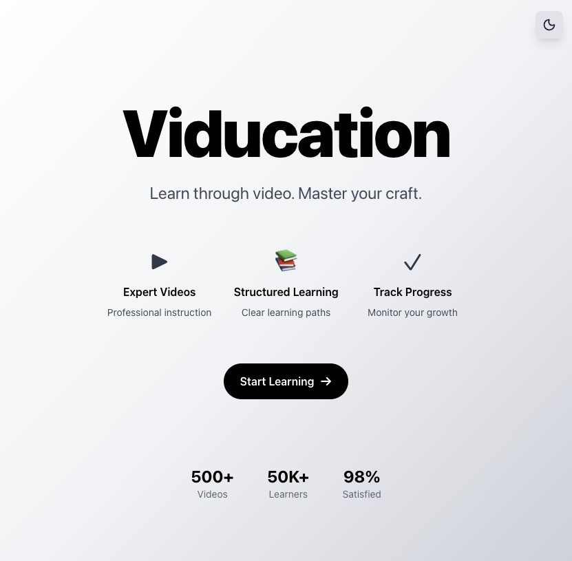
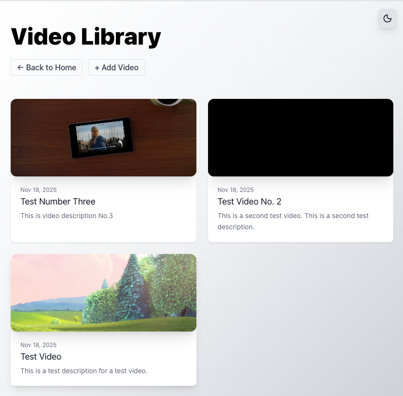
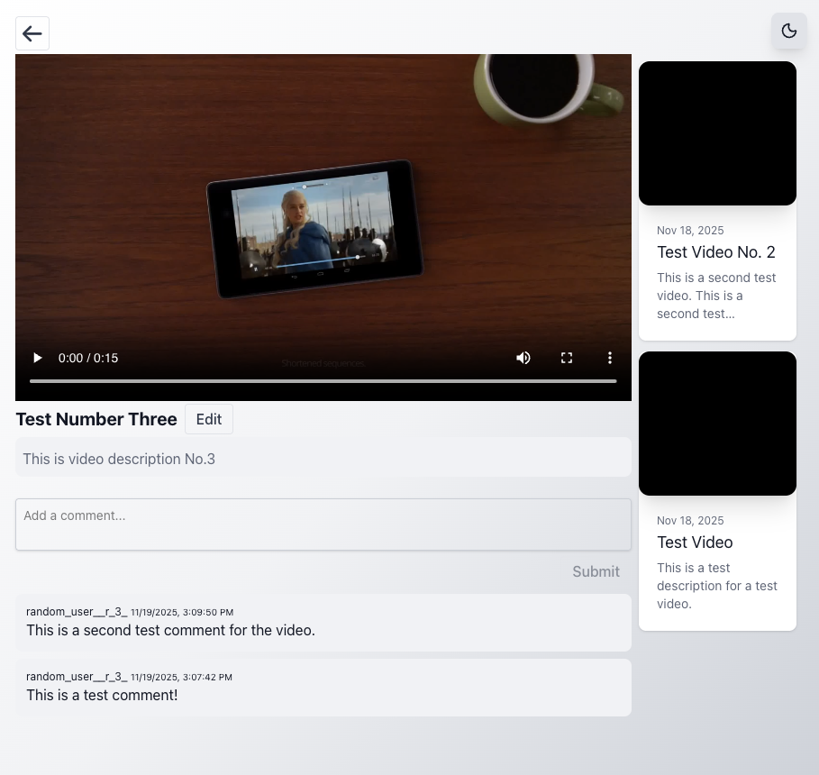
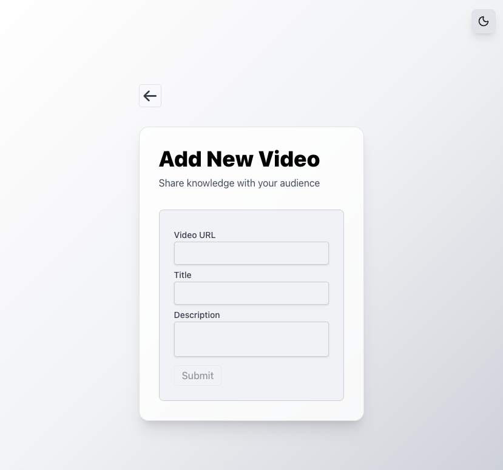
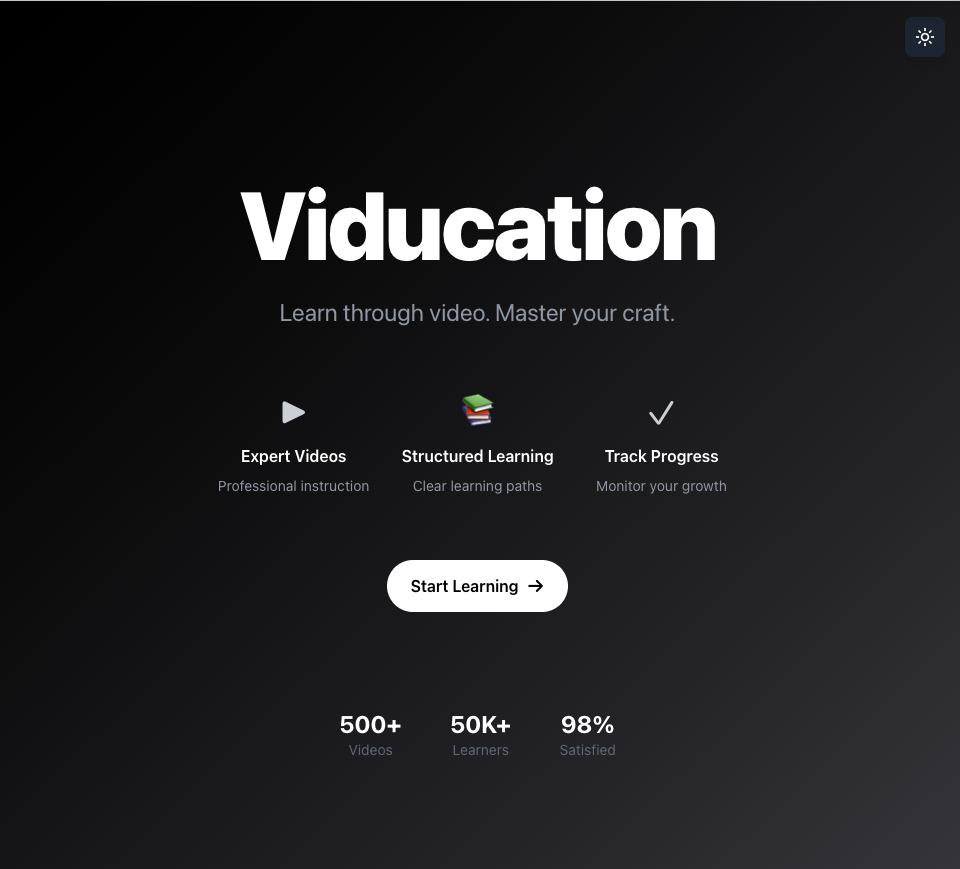
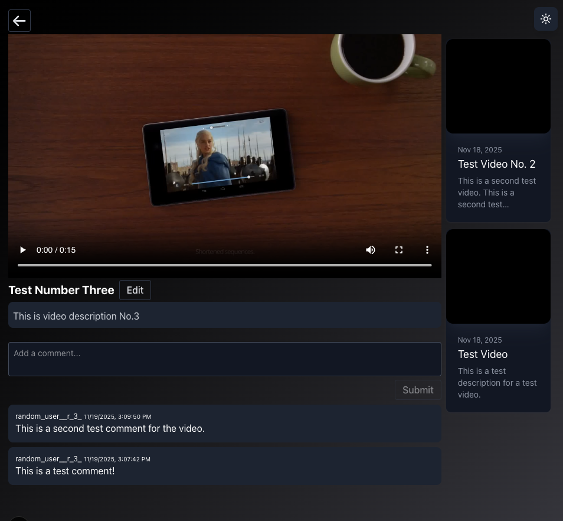

# Viducation - Educational Video Platform

(Simple app for code demo purposes)
Educational video platform built with Next.js and TypeScript. Users can upload videos, watch them, and comment.

## Features

-   Browse and watch educational videos
-   Upload new videos (title, description, URL)
-   Comment on videos
-   Edit video details
-   Dark mode support (& toggle)
-   Responsive design
-   Play video preview on hover

## Tech Stack

-   Next.js 15 (App Router)
-   TypeScript
-   Tailwind CSS
-   SWR for data fetching
-   Zod for API validation

## Setup

```bash
npm install
npm run dev
```

Open [http://localhost:3000](http://localhost:3000)

## Screenshots








## Architecture Notes

-   API requests in `lib/requests/`, wrapped by hooks in `lib/hooks/`
-   Branded types (`UserId`, `VideoId`) for type safety
-   Centralized route definitions in `utils/apiRoutes.ts` and `utils/appRoutes.ts`
-   SWR handles caching and revalidation
